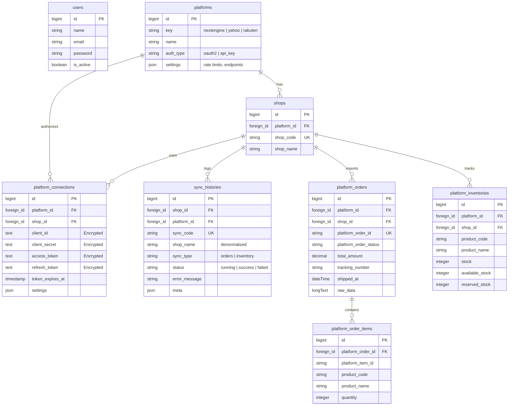

# NE Omnichannel Integration App (Sandbox)

A system designed to connect and automatically synchronize orders and inventory between major e-commerce platforms in Japan (**Rakuten**, **Yahoo Shopping**) and the central ERP system (**NextEngine**). This project is built on **Laravel 12**, **Vite 7**, and **Tailwind CSS v4**.

---

## Table of Contents
1. [Overview](#overview)
2. [Tech Stack](#tech-stack)
3. [Implementation Status](#implementation-status)
4. [Database Schema](#database-schema)
5. [Unimplemented Features and Future Work (TODO)](#unimplemented-features-and-future-work-todo)
6. [Installation and Quick Start Guide](#installation-and-quick-start-guide)
7. [Directory Structure](#directory-structure)

---

## Overview

This system allows B2C Administrators (Btoc Admin) to manage shop information, configure platform-specific credentials, and perform daily automated synchronization of order history, order items, and stock status.

All sensitive customer information and API keys are highly secured using database-level encryption.

---

## Tech Stack

*   **Backend Core:** PHP ^8.2, Laravel ^12.0
*   **Frontend Core:** Blade Templates, Tailwind CSS ^4.0, Vite ^7.0, Axios
*   **Database:** Flexible support for SQLite (local/testing environments) or MySQL (staging/production environments).
*   **Job & Queue:** Database Queue Driver for background processing of heavy synchronization tasks.
*   **Mail Service:** Integrates email delivery for shipment tracking updates to customers when tracking numbers are entered.

---

## Implementation Status

The table below summarizes the implementation status of each feature and component in the system:

| Feature Group | Description | Status | Related Files |
| :--- | :--- | :---: | :--- |
| **Btoc Admin Console** | Manage users, permissions, password updates, and enable/disable account status. | Completed | [UserController.php] |
| **Shop Management** | Add, edit, delete, search shops, and configure platform link relationships. | Completed | [ShopController.php] |
| **Information Security** | Automatically encrypt `client_id`, `client_secret`, `access_token`, and `refresh_token` before storing them in the database. | Completed | [PlatformConnection.php] |
| **NextEngine OAuth2** | Integrated OAuth2 authorization loop, using secure session nonces to prevent state and callback tampering. | Completed | [NextEngineConnector.php] |
| **NextEngine Sync API** | Synchronize Orders (`receiveorder_base`), Order Rows/Items (`receiveorder_row`), and Stock Master (`master_stock`). | Completed | [NextEngineConnector.php] |
| **Token Auto-Refresh** | Automatically update and persist the latest Access Token & Refresh Token returned by NextEngine with each API request. | Completed | `NextEngineConnector::updateTokens()` |
| **Order Management** | View synced orders list, advanced filtering, and update tracking numbers. | Completed | [OrderController.php] |
| **Shipment Notification Mail** | Automatically send beautifully formatted HTML notification emails to customers when a Tracking Number is entered. | Completed | [ShipmentNotificationMail.php] |
| **Inventory Management** | Track actual physical stock, available/free stock, and allocated/reserved stock. | Completed | [InventoryController.php] |
| **Sync History** | View history log of all order/inventory sync processes with detailed error messages if failed. | Completed | [SyncController.php] |
| **Yahoo Shopping** | Connect via Yahoo Shopping OAuth2 API to sync orders and inventory. | Unfinished (Stub) | [YahooConnector.php] |
| **Rakuten RMS** | Connect using API Key (ESA Authentication) of Rakuten RMS to manage orders and inventory. | Unfinished (Stub) | [RakutenConnector.php] |
| **Queue-based Sync** | Enable asynchronous background queues to avoid HTTP timeouts when syncing large amounts of data. | Partially Implemented (Stub) | [PlatformSyncJob.php] |
| **Webhook API** | Receive real-time push data notifications from e-commerce platforms. | Unfinished (Stub) | `webhookHandler()` in Connectors |

---

## Database Schema

The project organizes data through 10 main tables to support multi-platform synchronization in a flexible manner:



*   **`platform_connections`:** Stores credentials which are automatically encrypted via AES-256 using Eloquent Attribute Mutators integrating Laravel's `Crypt` component.
*   **`sync_histories`:** Stores the synchronization logs. Denormalizes the `shop_name` so that sync history details remain readable even if the associated shop is deleted in the future.

---

## Unimplemented Features and Future Work (TODO)

To prepare this system for production environments, the following core technical components need to be fully implemented:
### 1. Implement Yahoo Shopping Connector (`YahooConnector.php`)
*   **OAuth2 Flow:** Currently throws `RuntimeException`. The connection flow needs to be developed to acquire authorization codes and exchange access/refresh tokens according to Yahoo Japan Merchant API specs.
*   **Data Fetching and Mapping:** Implement logic to query Yahoo API endpoints for order details and inventory updates. Map the raw fields returned by Yahoo (e.g. `OrderId`, `BillZipCode`, `ShipAddress1`) to the standardized local platform fields.

### 2. Implement Rakuten Connector (`RakutenConnector.php`)
*   **API Key Authentication:** Rakuten RMS API uses Basic Authentication with a specific format: `ESA <Base64(serviceSecret:licenseKey)>`. Test and confirm successful handshake and connection.
*   **RMS API Integration:** Write integrations with the official Rakuten RMS API endpoints for orders (`RakutenPayOrderAPI`) and stock level adjustments (`InventoryAPI`).

### 3. Activate Asynchronous Queue Sync (Background Sync)
*   **Current Issue:** [SyncController.php](file:///d:/TranDangKhoa/Project/tool1-nextengine-prototype/app/Http/Controllers/Btoc/SyncController.php) calls `syncOrdersNow()` and `syncInventoryNow()` synchronously inside the HTTP request. This can cause HTTP 504 Gateway Timeouts when a shop contains a high volume of orders or products.
*   **Solution:** Switch to using the background methods `dispatchOrderSync()` and `dispatchInventorySync()` already written in `PlatformSyncService.php`. This will push the tasks to `PlatformSyncJob` queues. The web frontend will immediately display the "Running" state and poll status updates asynchronously from the `sync_histories` table.

### 4. Configure NextEngine Environment Variables
*   **Issue:** The `.env` file currently lacks the environment variables required for NextEngine:
    ```bash
    NEXT_ENGINE_BASE_URI=https://base.next-engine.org
    NEXT_ENGINE_API_URI=https://api.next-engine.org
    NEXT_ENGINE_REDIRECT_URI=http://localhost/nextengine/callback
    ```
    This causes the `PlatformSeeder` execution to insert empty/null values, preventing NextEngine OAuth login from functioning out of the box.
*   **Solution:** Complete the environment configuration variables in `.env.example` and the active `.env` file.

### 5. Write Unit and Feature Tests
*   **Current Status:** The `/tests` directory only contains default boilerplate test cases.
*   **Requirement:** Add tests to mock HTTP API requests to NextEngine, verify credential encryption/decryption models, validate synchronization data processing, and confirm tracking number update validation triggers.

---

## Installation and Quick Start Guide

### System Requirements
*   PHP >= 8.2 (Required)
*   Composer
*   Node.js & npm (For asset compiling)
*   MySQL/MariaDB or SQLite

### Setup Steps

The project provides automated scripts in `composer.json` to streamline the setup process in fewer commands:

**Step 1: Clone the repository and enter the directory:**
```bash
cd tool1-nextengine-prototype
```

**Step 2: Verify PHP and Composer versions:**
Run the following commands to check if PHP and Composer are installed and match the system requirements:
```bash
php -v
composer -v
```
Ensure your PHP version is **8.2.0 or higher**. If you do not have PHP or Composer installed, or if their versions are lower than required, you must install or upgrade them before proceeding.

**Step 3: Run the automated setup script:**
```bash
composer run setup
```
*This command automatically executes: composer package installations, node package installations, environment file copy from `.env.example`, generation of the `APP_KEY`, creation of a blank SQLite database, and executes database migrations & database seeding.*

**Step 4: Update NextEngine configuration**
Open the generated `.env` file and insert NextEngine parameters if available:
```env
NEXT_ENGINE_BASE_URI=https://base.next-engine.org
NEXT_ENGINE_API_URI=https://api.next-engine.org
NEXT_ENGINE_REDIRECT_URI=http://localhost:8000/nextengine/callback
```
*Re-run the platform seeder to apply these settings to your database:*
```bash
php artisan db:seed --class=PlatformSeeder
```

**Step 5: Start the development server:**
```bash
composer run dev
```
*This script launches the local Web Server (`artisan serve`), the Queue worker (`queue:listen`), the CLI log viewer (`pail`), and the Vite asset bundler concurrently.*

### Default Admin Login
*   **Dashboard URL:** [http://127.0.0.1:8000/btoc](http://127.0.0.1:8000/btoc) (requires login)
*   **Default credentials generated by `UserSeeder`:**
    *   **Email:** `admin@gmail.com`
    *   **Password:** `password123`

---

## Directory Structure

```
├── .github
│   └── workflows
├── app
│   ├── Connectors
│   │   ├── NextEngineConnector.php
│   │   ├── PlatformConnectorFactory.php
│   │   ├── RakutenConnector.php
│   │   └── YahooConnector.php
│   ├── Contracts
│   │   ├── ApiKeyConnector.php
│   │   ├── OAuthConnector.php
│   │   └── PlatformConnector.php
│   ├── Http
│   │   ├── Controllers
│   │   │   ├── Auth
│   │   │   │   └── LoginController.php
│   │   │   ├── Btoc
│   │   │   │   ├── DashboardController.php
│   │   │   │   ├── InventoryController.php
│   │   │   │   ├── OrderController.php
│   │   │   │   ├── ShopController.php
│   │   │   │   ├── SyncController.php
│   │   │   │   └── UserController.php
│   │   │   └── Controller.php
│   │   └── Middleware
│   │       └── EnsureUserIsActive.php
│   ├── Jobs
│   │   └── PlatformSyncJob.php
│   ├── Mail
│   │   └── ShipmentNotificationMail.php
│   ├── Models
│   │   ├── Platform.php
│   │   ├── PlatformConnection.php
│   │   ├── PlatformInventory.php
│   │   ├── PlatformOrder.php
│   │   ├── PlatformOrderItem.php
│   │   ├── Shop.php
│   │   ├── SyncHistory.php
│   │   └── User.php
│   ├── Providers
│   │   └── AppServiceProvider.php
│   └── Services
│       └── PlatformSyncService.php
├── bootstrap
│   ├── app.php
│   └── providers.php
├── config
│   ├── app.php
│   ├── auth.php
│   ├── cache.php
│   ├── database.php
│   ├── filesystems.php
│   ├── logging.php
│   ├── mail.php
│   ├── queue.php
│   ├── services.php
│   └── session.php
├── database
│   ├── factories
│   │   └── UserFactory.php
│   ├── migrations
│   │   ├── 0001_01_01_000000_create_users_table.php
│   │   ├── 0001_01_01_000001_create_cache_table.php
│   │   ├── 0001_01_01_000002_create_jobs_table.php
│   │   ├── 2026_03_22_100001_create_platforms_table.php
│   │   ├── 2026_03_22_100002_create_shops_table.php
│   │   ├── 2026_03_22_100003_create_platform_connections_table.php
│   │   ├── 2026_03_22_100004_create_sync_histories_table.php
│   │   ├── 2026_03_22_100005_create_platform_orders_table.php
│   │   ├── 2026_03_22_100006_create_platform_order_items_table.php
│   │   └── 2026_03_22_100007_create_platform_inventories_table.php
│   ├── seeders
│   │   ├── DatabaseSeeder.php
│   │   ├── PlatformSeeder.php
│   │   └── UserSeeder.php
│   └── .gitignore
├── public
│   ├── .htaccess
│   ├── favicon.ico
│   ├── index.php
│   └── robots.txt
├── resources
│   ├── css
│   │   └── app.css
│   ├── js
│   │   ├── app.js
│   │   └── bootstrap.js
│   └── views
│       ├── auth
│       │   └── login.blade.php
│       ├── btoc
│       │   ├── orders
│       │   │   ├── detail.blade.php
│       │   │   └── index.blade.php
│       │   ├── shop
│       │   │   ├── detail.blade.php
│       │   │   ├── index.blade.php
│       │   │   └── save.blade.php
│       │   ├── sync
│       │   │   ├── detail.blade.php
│       │   │   └── history.blade.php
│       │   ├── users
│       │   │   ├── change_password.blade.php
│       │   │   ├── index.blade.php
│       │   │   └── save.blade.php
│       │   ├── dashboard.blade.php
│       │   └── inventory.blade.php
│       ├── emails
│       │   └── shipment_notification.blade.php
│       ├── layouts
│       │   ├── app.blade.php
│       │   └── sidebar.blade.php
│       └── welcome.blade.php
├── routes
│   ├── console.php
│   └── web.php
├── storage
├── tests
├── .editorconfig
├── .env.example
├── .gitattributes
├── .gitignore
├── .styleci.yml
├── CHANGELOG.md
├── README.md
├── artisan
├── composer.json
├── laravel
├── nextengine
├── package-lock.json
├── package.json
├── phpunit.xml
├── test_cicd.txt
└── vite.config.js
```
